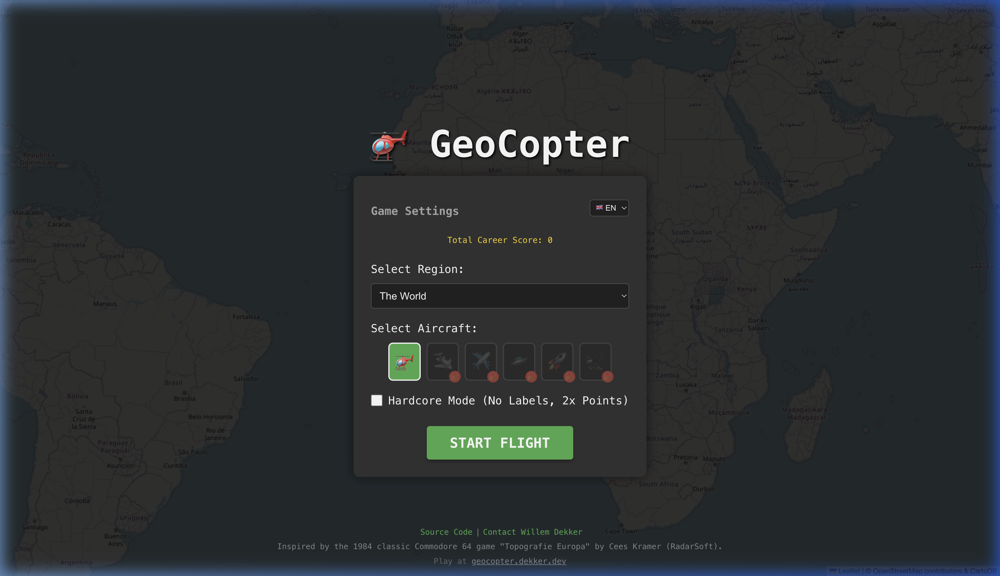

# 🚁 GeoCopter

**[Play GeoCopter directly in your browser!](https://geocopter.dekker.dev)**

A nostalgic, top-down geography flight simulator built with React and Leaflet! Navigate your helicopter across the world map to locate hidden cities before the fuel timer runs out.



## Origin & Inspiration
This game is a passionate modern recreation of the classic Commodore 64 game **"Geography Europe"** (Topografie Europa), originally authored by **Cees Kramer** of the legendary Dutch software company **RadarSoft** in 1984. 

The original C64 game sparked fierce geographic competitions in school classrooms across Europe during the 80s and 90s, where students would race to find locations as fast as possible. This modern, web-based version aims to resurrect that same exciting, educational VIBE for a new generation!

**Built using "Vibe Coding"**: The entire architecture and source code for this revival was written in collaboration with an AI utilizing the **Antigravity IDE**.

## Features
- **Global & Regional Maps:** Fly across "The World" or focus on specific regions like Europe, The Americas, or The Netherlands.
- **Endless Exploration:** The global map features seamless longitudinal wrapping, allowing you to fly continuously around the Earth!
- **Hardcore Mode:** Test your true geographic knowledge by turning off city labels and geographical borders.
- **Proximity Radar & Compass:** Use the signal strength indicator (Weak, Medium, Strong) and dynamic compass hint to triangulate your target.
- **Persistent High Scores:** Compete against yourself! Scores are saved locally via `localStorage` and filter independently per region and difficulty.
- **Procedural Audio:** Retro-inspired synthesized 8-bit sound effects.

## How to Play
1. Select a Region and Difficulty.
2. Click **Start Flight**.
3. Use the **WASD** / **Arrow Keys** to pilot the helicopter, OR click anywhere on the map to fly to that pointer location.
4. Pilot the helicopter to the target City displayed in the upper-left HUD.
5. Get within the collision radius to earn points and receive a new target!

## Local Development

### Prerequisites
- Node.js (v18+)
- npm or yarn

### Installation
1. Clone the repository:
   ```bash
   git clone https://github.com/wdekker/geocopter.git
   cd geocopter
   ```
2. Install dependencies:
   ```bash
   npm install
   ```
3. Generate the procedural audio assets (only required if modifying sounds):
   *(Note: Pre-compiled `.wav` and `.mp3` files are already located in `public/sounds/`)*
   ```bash
   node generate_sounds.js
   ```
4. Start the Vite development server:
   ```bash
   npm run dev
   ```
5. Open `http://localhost:5173` in your browser.

## Tech Stack
- **React 18** (Vite template)
- **TypeScript**
- **Leaflet / React-Leaflet** (Map Engine)
- **Wavefile API** (Procedural Audio generation)

## Contact & Credits
- **Source Code**: [GitHub Repository](https://github.com/wdekker/geocopter)
- **Author**: Willem Dekker - [Contact Me](https://www.dekker.dev/contact/)

## License
This project is open-source and available under the [MIT License](LICENSE).
